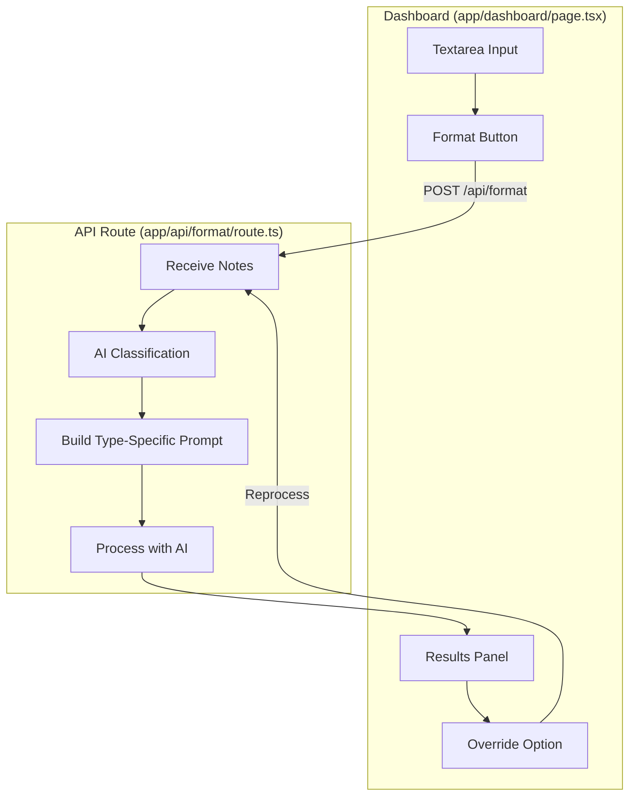

# Design Document

## Overview

This feature enhances TaskClarify by removing the manual task type selector and implementing AI-powered auto-detection. Instead of keyword matching, the AI will analyze the content context to determine if notes are personal (shopping, budgets, personal tasks) or software-related (features, APIs, requirements).

## Architecture



## Components and Interfaces

### Changes to Dashboard

1. **Remove**: Task type selector dropdown and related state
2. **Keep**: `taskType` state for override functionality
3. **Add**: Override UI in results header

### Changes to API Route

1. **Remove**: Import of `detectTaskType` from keyword matcher
2. **Add**: AI-powered classification in the prompt
3. **Modify**: Let AI determine `detectedType` in response

### Updated Request/Response

```typescript
// Request - no taskType needed (or optional for override)
interface FormatRequest {
  notes: string;
  taskType?: 'personal' | 'software'; // Only for override
}

// Response already includes detectedType
interface FormattedResult {
  detectedType: 'personal' | 'software';
  // ... rest of fields
}
```

## Data Models

No changes to existing data models. The `detectedType` field already exists in both `PersonalPlanResult` and `SoftwareRequirementResult`.

## Correctness Properties

*A property is a characteristic or behavior that should hold true across all valid executions of a system.*

### Property 1: AI classification consistency
*For any* input containing clear personal indicators (budget amounts, shopping lists, "I want to buy"), the AI should classify as "personal".
**Validates: Requirements 2.2, 2.3**

### Property 2: Context locking for personal plans
*For any* input classified as "personal", the result should NOT contain technicalRequirements or systemArchitecture fields.
**Validates: Requirements 2.4**

### Property 3: Override reprocessing
*For any* override action, the system should reprocess with the selected type and return results matching that type.
**Validates: Requirements 4.3**

## Error Handling

- **AI classification failure**: Default to "software" type
- **Override reprocessing failure**: Show error, keep previous results
- **Network error**: Display error message, allow retry

## Testing Strategy

### Property-Based Testing Library
- **Library**: fast-check
- **Configuration**: 100 iterations per property

### Manual Testing
- Test with clear personal notes (shopping lists, budgets)
- Test with clear software notes (feature requests, API specs)
- Test with ambiguous notes (mixed signals)
- Test override functionality
