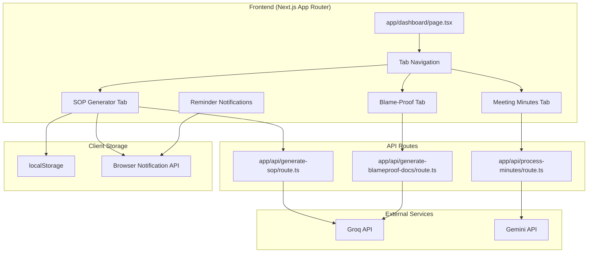

# Design Document

## Overview

This feature enhances TaskClarify with three major additions:

1. **AI-Powered Blame-Proof Docs** - Upgrade from simple templates to Groq AI for contextual document generation
2. **Meeting Minutes Tab** - Dedicated UI tab for voice recording → structured meeting minutes
3. **SOP Generator Tab** - Generate Standard Operating Procedures with save/like and step reminders

The core innovation is the **SOP Reminder System** - users can save SOPs with a start time, and the system calculates reminder times for each step based on durations, sending browser notifications when each step is due.

## Architecture



## Components and Interfaces

### SOP Types

```typescript
interface SOPStep {
  id: string;
  stepNumber: number;
  title: string;
  description: string;
  estimatedDuration: number; // in minutes
  tips: string[];
  completed: boolean;
  scheduledTime?: Date;
}

interface SOP {
  id: string;
  name: string;
  summary: string;
  totalDuration: number; // in minutes
  steps: SOPStep[];
  unclearPoints: string[];
  createdAt: string;
}

interface SavedSOP extends SOP {
  startTime: Date;
  status: 'scheduled' | 'in-progress' | 'completed' | 'archived';
  currentStepIndex: number;
  reminders: SOPReminder[];
}

interface SOPReminder {
  stepId: string;
  scheduledTime: Date;
  triggered: boolean;
  snoozedUntil?: Date;
}
```

### Meeting Minutes Types

```typescript
interface MeetingMinutes {
  id: string;
  title: string;
  date: string;
  attendees: string[];
  agendaItems: string[];
  discussionPoints: DiscussionPoint[];
  actionItems: ActionItem[];
  decisions: string[];
  nextSteps: string[];
  rawTranscript: string;
  createdAt: string;
}

interface DiscussionPoint {
  topic: string;
  summary: string;
  participants: string[];
}

interface ActionItem {
  task: string;
  owner: string;
  deadline?: string;
  status: 'pending' | 'completed';
}
```

### Blame-Proof Types (Enhanced)

```typescript
interface BlameProofDocs {
  paperTrailEmail: string;
  actionPlan: ActionPlanSection;
  timelineTracker: TimelineEntry[];
  meetingAgenda: MeetingAgendaSection;
  context: {
    issue: string;
    urgency: 'low' | 'medium' | 'high' | 'critical';
    stakeholders: string[];
    timeline: string;
  };
}

interface ActionPlanSection {
  immediateActions: string[];
  shortTermActions: string[];
  longTermActions: string[];
  blockers: string[];
}

interface TimelineEntry {
  timestamp: string;
  event: string;
  actor: string;
}

interface MeetingAgendaSection {
  title: string;
  duration: string;
  items: AgendaItem[];
  preparation: string[];
}

interface AgendaItem {
  topic: string;
  duration: string;
  owner: string;
}
```

## Data Models

### Tab State Management

```typescript
type DashboardTab = 'format' | 'blameproof' | 'minutes' | 'sop' | 'saved';

interface DashboardState {
  activeTab: DashboardTab;
  // Each tab maintains its own state
  formatState: FormatTabState;
  blameproofState: BlameProofTabState;
  minutesState: MinutesTabState;
  sopState: SOPTabState;
  savedState: SavedTabState;
}
```

### Reminder Scheduling Logic

```typescript
function calculateReminderTimes(sop: SOP, startTime: Date): SOPReminder[] {
  let currentTime = new Date(startTime);
  return sop.steps.map(step => {
    const reminder: SOPReminder = {
      stepId: step.id,
      scheduledTime: new Date(currentTime),
      triggered: false
    };
    // Add step duration to get next step's time
    currentTime = new Date(currentTime.getTime() + step.estimatedDuration * 60000);
    return reminder;
  });
}
```

## Correctness Properties

*A property is a characteristic or behavior that should hold true across all valid executions of a system-essentially, a formal statement about what the system should do. Properties serve as the bridge between human-readable specifications and machine-verifiable correctness guarantees.*

### Property 1: SOP step completeness
*For any* generated SOP, each step SHALL contain a title, description, estimatedDuration, and tips array.
**Validates: Requirements 1.2**

### Property 2: SOP total duration calculation
*For any* generated SOP, the totalDuration SHALL equal the sum of all step estimatedDurations.
**Validates: Requirements 1.3**

### Property 3: Saved SOP unique identifier
*For any* saved SOP, the system SHALL assign a unique identifier that does not conflict with existing saved SOPs.
**Validates: Requirements 2.1**

### Property 4: Reminder time calculation
*For any* saved SOP with a start time, the reminder times SHALL be calculated sequentially based on step durations starting from the start time.
**Validates: Requirements 2.3**

### Property 5: Step completion state transition
*For any* SOP step marked as complete, the currentStepIndex SHALL increment and the next step's reminder SHALL be scheduled.
**Validates: Requirements 3.3**

### Property 6: Snooze rescheduling
*For any* dismissed reminder, the system SHALL reschedule the reminder to the current time plus the snooze duration.
**Validates: Requirements 3.4**

### Property 7: Tab state preservation
*For any* tab switch, the previous tab's state SHALL remain unchanged when switching back.
**Validates: Requirements 5.3**

### Property 8: SOP progress calculation
*For any* saved SOP, the progress SHALL equal (completed steps count / total steps count).
**Validates: Requirements 6.3**

### Property 9: SOP completion archival
*For any* SOP where all steps are completed, the status SHALL transition to 'completed' or 'archived'.
**Validates: Requirements 6.4**

### Property 10: Blame-proof contextual output
*For any* blame-proof document generation, the output SHALL contain references to the input issue context.
**Validates: Requirements 7.1, 7.4**

## Error Handling

### Frontend Errors
- **Empty input**: Button disabled, no submission possible
- **API failure**: Display error message, allow retry
- **Notification permission denied**: Show fallback UI reminder
- **localStorage full**: Warn user, suggest exporting old SOPs

### API Route Errors
- **Missing input**: Return 400 Bad Request
- **AI API error**: Return 500 with error message
- **JSON parse error**: Return 500 with parsing error message

### Reminder System Errors
- **Browser doesn't support notifications**: Use in-app toast notifications
- **Tab not active**: Queue notifications for when tab becomes active

## Testing Strategy

### Property-Based Testing Library
- **Library**: fast-check (TypeScript property-based testing)
- **Configuration**: Minimum 100 iterations per property test

### Unit Tests
- Test SOP generation output structure
- Test reminder time calculation
- Test step completion state transitions
- Test tab state preservation
- Test progress calculation
- Test localStorage operations

### Integration Tests
- Test full SOP generation flow
- Test save → reminder → complete flow
- Test meeting minutes generation
- Test blame-proof document generation
