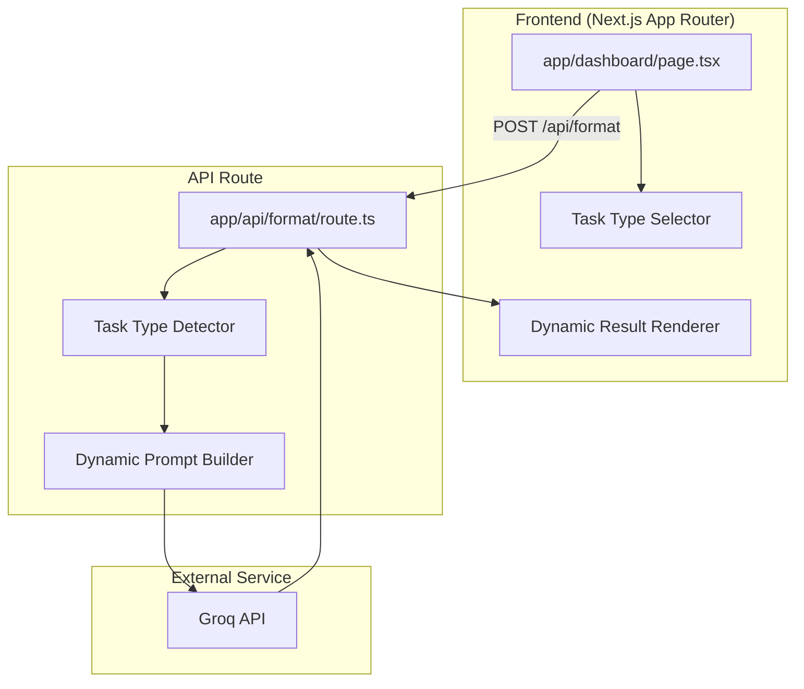

# Design Document

## Overview

TaskClarify is a Next.js 14 application that transforms unstructured notes into context-appropriate structured outputs. The key innovation is **Task Type Detection** - the system identifies whether input is a personal execution plan, software requirement, business task, etc., and formats output accordingly.

The core flow is:
1. User enters notes in textarea
2. User optionally selects task type (or uses auto-detect)
3. User clicks "Format with AI" button
4. API route detects task type and sends appropriate prompt
5. AI returns structured JSON based on task type
6. Frontend displays results in the appropriate format

## Architecture



## Components and Interfaces

### Task Types

```typescript
type TaskType = 'auto' | 'personal' | 'software' | 'business' | 'marketing' | 'financial';
```

### Request/Response Interfaces

```typescript
interface FormatRequest {
  notes: string;
  taskType: TaskType;
}

// Personal Plan Result (for personal execution plans)
interface PersonalPlanResult {
  type: 'personal';
  taskName: string;
  summary: string;
  budgetBreakdown?: BudgetItem[];
  executionSteps: ExecutionStep[];
  constraints: string[];
  risks: Risk[];
  checkpoints: string[];
  unclearPoints: string[];
}

interface BudgetItem {
  category: string;
  amount: string;
  details: string;
}

interface ExecutionStep {
  step: number;
  action: string;
  details: string;
  location?: string;
  tips?: string[];
}

// Software Requirement Result (existing PRD-style)
interface SoftwareRequirementResult {
  type: 'software';
  taskName: string;
  summary: string;
  priority: 'HIGH' | 'MEDIUM' | 'LOW';
  estimatedComplexity: 'Simple' | 'Moderate' | 'Complex';
  functionalRequirements: FunctionalRequirement[];
  technicalRequirements: TechnicalRequirement[];
  userStories: UserStory[];
  unclearPoints: UnclearPoint[];
  questionsForStakeholder: StakeholderQuestion[];
  assumptions: string[];
  outOfScope: string[];
  dependencies: string[];
  risks: Risk[];
}

type FormatResult = PersonalPlanResult | SoftwareRequirementResult;
```

## Data Models

### Task Type Detection Logic

The API uses content analysis to detect task type when "auto" is selected:

```typescript
function detectTaskType(notes: string): TaskType {
  const lowerNotes = notes.toLowerCase();
  
  // Personal indicators: budget amounts, shopping lists, personal pronouns
  const personalIndicators = ['budget', 'buy', 'rent', 'salary', 'spend', 'save', 'my ', 'i want', 'i need'];
  
  // Software indicators: feature, API, database, UI, component
  const softwareIndicators = ['feature', 'api', 'database', 'component', 'user story', 'acceptance criteria', 'endpoint'];
  
  // Score and return highest match
  // ...
}
```

## Correctness Properties

*A property is a characteristic or behavior that should hold true across all valid executions of a system-essentially, a formal statement about what the system should do. Properties serve as the bridge between human-readable specifications and machine-verifiable correctness guarantees.*

### Property 1: Task type selector state
*For any* task type selection, the component state should reflect the selected task type value.
**Validates: Requirements 2.1, 2.3**

### Property 2: Context locking for personal plans
*For any* input processed with task type "personal", the result should NOT contain technicalRequirements or systemArchitecture fields.
**Validates: Requirements 2.4, 4.5**

### Property 3: Personal plan result completeness
*For any* valid PersonalPlanResult object, the rendered output should contain executionSteps, constraints, and risks.
**Validates: Requirements 4.2, 4.3, 4.4**

### Property 4: Software requirement result completeness
*For any* valid SoftwareRequirementResult object, the rendered output should contain functionalRequirements, technicalRequirements, and userStories.
**Validates: Requirements 5.1, 5.2, 5.3**

### Property 5: API error propagation
*For any* API error response, the UI should display an error message to the user.
**Validates: Requirements 3.3**

## Error Handling

### Frontend Errors
- **Empty input**: Button disabled, no submission possible
- **API failure**: Display error message, allow retry
- **Network error**: Display connection error message

### API Route Errors
- **Missing notes**: Return 400 Bad Request
- **AI API error**: Return 500 with error message
- **JSON parse error**: Return 500 with parsing error message

## Testing Strategy

### Property-Based Testing Library
- **Library**: fast-check (TypeScript property-based testing)
- **Configuration**: Minimum 100 iterations per property test

### Unit Tests
- Test task type selector renders all options
- Test task type detection logic
- Test personal plan result rendering
- Test software requirement result rendering
- Test error handling for various failure modes
