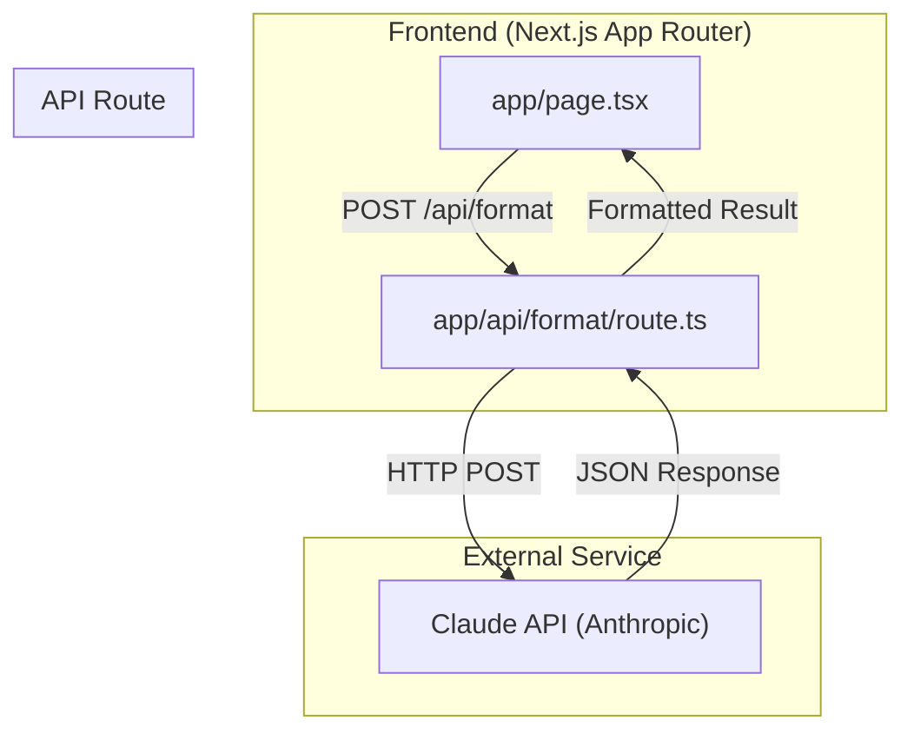

# Design Document

## Overview

TaskClarify is a minimal Next.js 14 application that transforms unstructured meeting notes into structured task requirements using Claude AI. The application consists of a single-page interface with a textarea for input, a processing button, and a results display area.

The core flow is:
1. User enters meeting notes in textarea
2. User clicks "Format with AI" button
3. Frontend calls API route
4. API route sends notes to Claude API
5. Claude returns structured JSON
6. Frontend displays formatted results

## Architecture



## Components and Interfaces

### Frontend Components

**Page Component (`app/page.tsx`)**
- Main landing page component
- Manages state: notes input, loading state, result, error
- Handles form submission
- Renders textarea, button, and results

### API Route

**Format Route (`app/api/format/route.ts`)**
- POST endpoint that accepts meeting notes
- Calls Claude API with structured prompt
- Parses JSON response
- Returns formatted result or error

### Interfaces

```typescript
// Request body for /api/format
interface FormatRequest {
  notes: string;
}

// Response from /api/format
interface FormatResponse {
  taskName: string;
  requirements: string[];
  unclearPoints: string[];
  questions: string[];
}

// Error response
interface ErrorResponse {
  error: string;
}
```

## Data Models

### FormattedResult

```typescript
interface FormattedResult {
  taskName: string;        // Extracted task name from notes
  requirements: string[];  // List of clear requirements
  unclearPoints: string[]; // Ambiguous items needing clarification
  questions: string[];     // Suggested clarifying questions
}
```

### Component State

```typescript
interface PageState {
  notes: string;           // User input text
  loading: boolean;        // API request in progress
  result: FormattedResult | null;  // Parsed API response
  error: string | null;    // Error message if request failed
}
```


## Correctness Properties

*A property is a characteristic or behavior that should hold true across all valid executions of a system-essentially, a formal statement about what the system should do. Properties serve as the bridge between human-readable specifications and machine-verifiable correctness guarantees.*

### Property 1: Input state synchronization
*For any* string typed into the textarea, the component state should reflect that exact string value.
**Validates: Requirements 1.2**

### Property 2: Empty input disables submission
*For any* input that is empty or contains only whitespace characters, the format button should be disabled.
**Validates: Requirements 1.3**

### Property 3: Result rendering completeness
*For any* valid FormattedResult object, the rendered output should contain the taskName, all requirements items, all unclearPoints items, and all questions items.
**Validates: Requirements 3.1, 3.2, 3.3, 3.4**

### Property 4: API error propagation
*For any* API error response, the UI should display an error message to the user.
**Validates: Requirements 2.3**

### Property 5: JSON parsing correctness
*For any* valid JSON string containing taskName, requirements, unclearPoints, and questions fields, parsing should extract all fields with correct values.
**Validates: Requirements 5.2**

### Property 6: Malformed JSON error handling
*For any* malformed or invalid JSON response from Claude API, the API route should return an error response.
**Validates: Requirements 5.3**

## Error Handling

### Frontend Errors
- **Empty input**: Button disabled, no submission possible
- **API failure**: Display error message, allow retry
- **Network error**: Display connection error message

### API Route Errors
- **Missing notes**: Return 400 Bad Request
- **Claude API error**: Return 500 with error message
- **JSON parse error**: Return 500 with parsing error message
- **Missing API key**: Return 500 with configuration error

### Error Response Format
```typescript
{
  error: string;  // Human-readable error message
}
```

## Testing Strategy

### Property-Based Testing Library
- **Library**: fast-check (TypeScript property-based testing)
- **Configuration**: Minimum 100 iterations per property test

### Unit Tests
- Test textarea renders with correct dimensions
- Test button disabled state when input empty
- Test loading state during API call
- Test API route returns correct response format
- Test error handling for various failure modes

### Property-Based Tests
Each property test must be tagged with: `**Feature: task-clarify, Property {number}: {property_text}**`

1. **Property 1 Test**: Generate random strings, verify state matches input
2. **Property 2 Test**: Generate whitespace-only strings, verify button disabled
3. **Property 3 Test**: Generate random FormattedResult objects, verify all fields rendered
4. **Property 4 Test**: Generate error responses, verify error displayed
5. **Property 5 Test**: Generate valid JSON structures, verify parsing extracts all fields
6. **Property 6 Test**: Generate malformed JSON strings, verify error returned

### Test File Structure
```
__tests__/
  page.test.tsx          # Component unit tests
  page.property.test.tsx # Property-based tests for UI
  api/
    format.test.ts       # API route unit tests
    format.property.test.ts # Property-based tests for API
```
